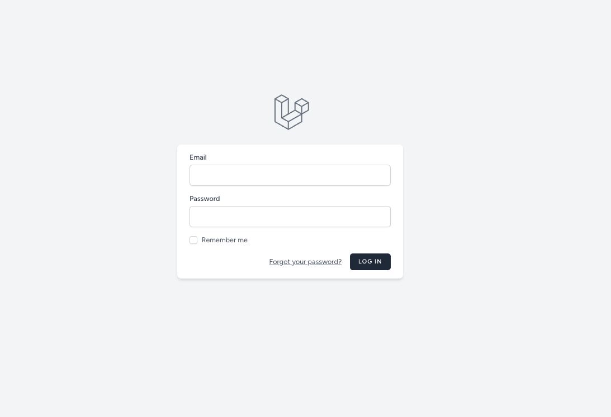
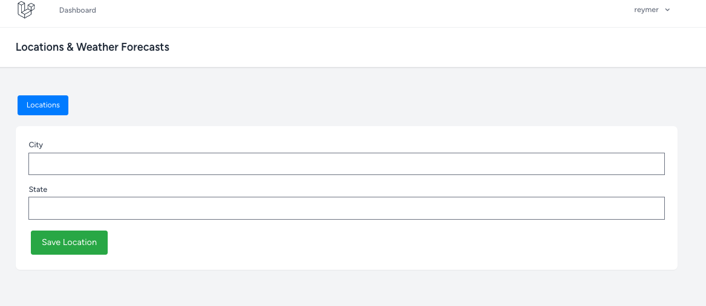
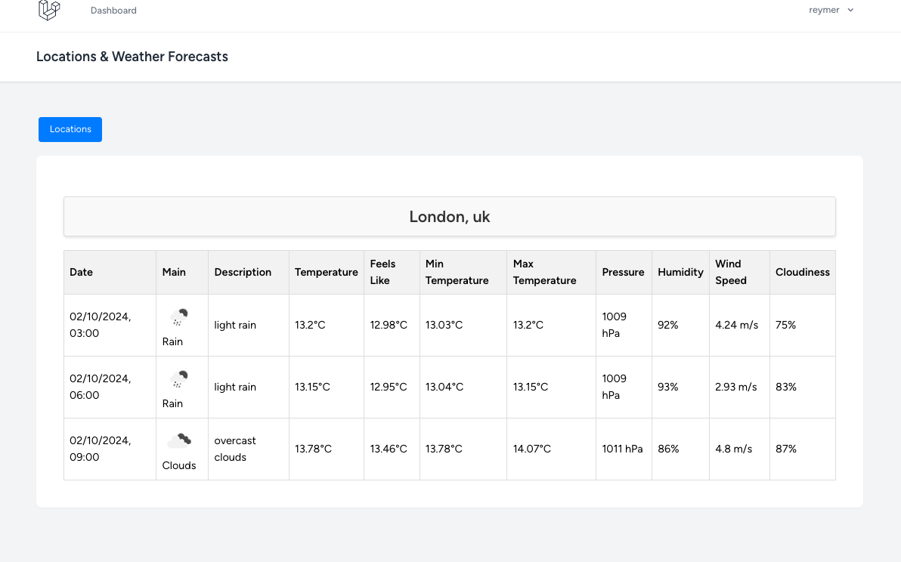

# Water Jug Challenge

An application using Laravel and Vue3 for Weather Forecast API

## Introduction

This project is an API that includes a backend built with Laravel and Laravel Sail, and a frontend build with Inertia + Vue3 + Typescript. The backend is containerized using Docker, allowing for easy deployment and management. 

## Table of Contents

- [Installation](#installation)
- [Usage](#usage)

## Installation

### Prerequisites

- [Docker](https://www.docker.com/)

### Setup

1. **Clone the repository:**

    ```bash
    git clone git@github.com:francysreymer/weather-api-laravel-vue3.git
    cd weather-api-laravel-vue3
    ```

2. **Make the file local-deploy.sh executable:**

    ```bash
    chmod +x local-deploy.sh
    ```

7. **Then run the script:**

    ```bash
    ./local-deploy.sh
    ```
The application should now be runnig at [http://localhost/login](http://localhost/login).
You should see a login page like this:




## Usage

- **Frontend:** Accessible at [http://localhost/logim](http://localhost/login).

## Users Seed

The application comes with a set of pre-generated user accounts for testing purposes. These accounts are seeded into the database using the `UserSeeder` class. Below are the details of the seeded user accounts:

### Seeded User Accounts

| Username       | Email                | Password  |
| -------------- | -------------------- | --------- |
| User One       | test1@test.com       | password  |
| User Two       | test2@test.com       | password  |

## Pages After Login

After logging in, users will be able to navigate through the following pages:

### Locations

The locations provides a page that shows all the city,states created by the logged user


### Add New Location

The add new location page allows the logged user to add a specific city/state in order to see their weather forecast



### View Weather Forecasts

The view weather forecasts page lists 3 weather forecasts for the specific location that had been previously saved


